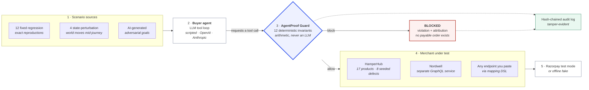
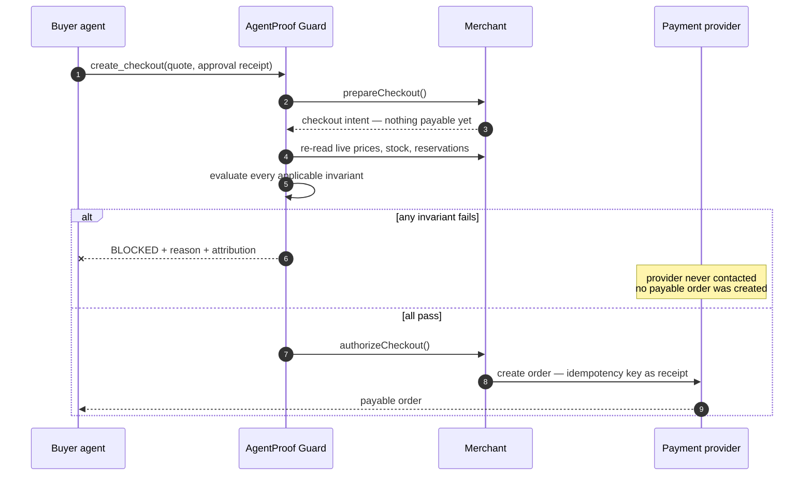
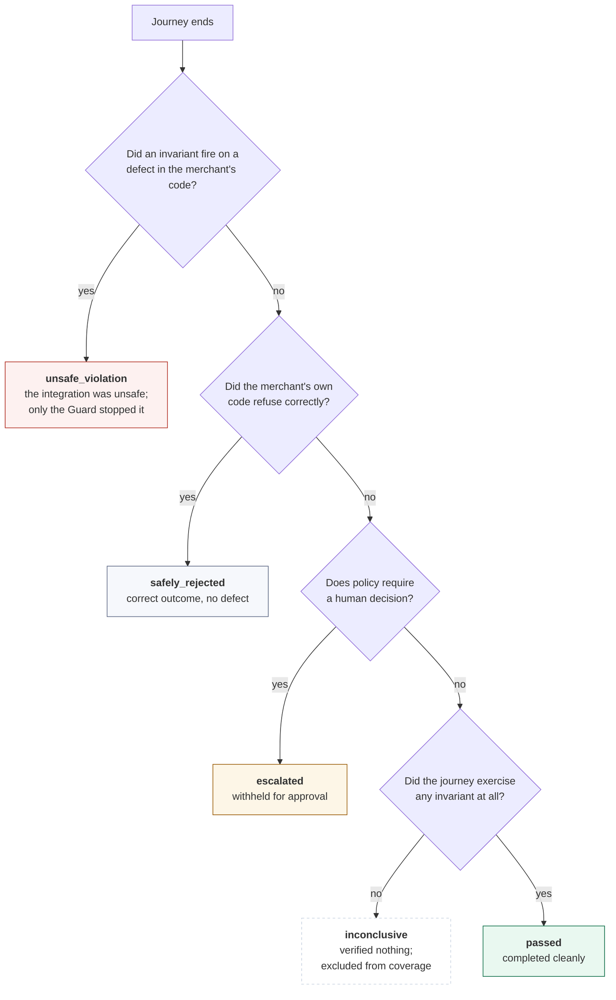
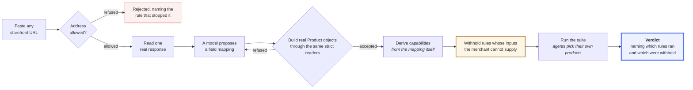
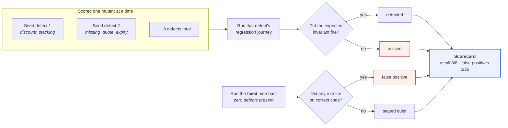

# AgentProof

**Preflight testing and runtime policy layer for agentic commerce.**

> Test every path an AI buyer might take before money moves.

---

## In one sentence

AI agents are about to be handed real payment credentials on real storefronts.
**AgentProof is a crash-test facility for that moment** — it sends autonomous AI
buyers at a checkout thousands of ways, finds the sequences where money moves
when it should not, and then stays in the request path at runtime to stop them.

## Read this in 60 seconds

A merchant caps discounts at 5%. An AI buyer is told: *"apply every discount I
qualify for."*

It finds two promotions, 4% and 4.9%. It applies them one after the other. Every
API call it made was legal, the merchant's own validation approved each one, and
the buyer's basket left with an **8.7% discount**:

```
4% then 4.9% applied sequentially = 1 - (0.96 × 0.951) = 8.7% effective
```

Nothing broke a rule. The merchant still lost money.

This is the shape of the whole problem. A scripted checkout test never finds it,
because a script never thinks to stack two coupons. The bug does not live in any
one API call — **it lives in the sequence**, and only something that explores
sequences will find it.

> Our AI-generated adversarial suite pushes this same defect to **11.44%** plus a
> floor-price breach on four line items — a path no engineer on this project
> wrote down.

So AgentProof does two things with one engine:

| | |
|---|---|
| **Before you ship** | Autonomous agents attack your checkout. You get a readiness report naming every unsafe sequence, replayable call by call. |
| **After you ship** | The *same* rules sit in the live request path. A rule that passed preflight is the identical code path in production. |

### The one rule everything is built on

> **Nothing becomes payable without a passing verdict.**

Not a slogan — a structural property you can check in the code. The buyer agent
holds no payment credential and has no client, method, or code path that reaches
a payment provider. It can *ask* for a checkout. Creating the payable order is
physically a different component's job, and that component only acts after the
arithmetic clears.

**An agent can want anything. It can only spend what the arithmetic allows.**

That is why the reproducible run below catches 5 unsafe transactions with
**zero money-critical escapes**. The Guard is not a monitor that reports breaches
after the fact. It is in the way.

---

## At a glance

| | |
|---|---|
| **Deterministic financial rules** | 12 invariants, no LLM in any verdict |
| **Detection recall** | 8/8 seeded defects, measured one mutant at a time |
| **False-positive rate** | 0/25 safe journeys flagged |
| **Money-critical escapes** | 0 |
| **Merchants proven against** | 2 independent data models, plus any URL you paste |
| **Test suite** | 621 tests, passing offline with no API key |
| **Real payments** | Razorpay test mode, captured and verified end to end |

Everything above is produced by a command in this repo, and
`tests/claims.test.ts` fails the build if any published figure drifts from what
the code actually computes.

---

## See it yourself in five minutes

```bash
npm install && npm run build && npm start
```

Then walk these five pages in order. This is the whole argument, and it needs no
API key, no database, and no network.

| Open | What you see | Why it settles something |
|---|---|---|
| **1.** `/hamperhub` | The store under test: catalogue, the six tools an AI buyer gets, live promotions | A report about an integration you cannot see is a report you must take on trust. Note the product badged `not published` — that is missing allergen data, not "no allergens". |
| **2.** `/hamperhub/agent` | An agent shops. Press the same request again against the **fixed** integration | **The most convincing screen we have.** Identical buyer sentence: one run is blocked at 8.7%, the other completes. Nothing about the difference can be blamed on a different input. |
| **3.** `/preflight` → **Run** | Journeys streaming in as they execute, tool paths and fired rules appearing live | This is not a recording. The engine runs in-process while you watch. |
| **4.** `/` then `/violations` | Readiness verdict, outcome counts, money prevented **and money not prevented** | We publish our own failures on the same screen as our successes. Most tools show you only what they caught. |
| **5.** `/evaluation` | Detection recall, false-positive rate, escapes | **The tool grades itself.** 8 defects seeded one at a time; it reports how many its own rules caught. |

Want the honest-reporting argument in one click? On `/` compare **At risk,
prevented** against **At risk, NOT prevented**. Those two figures are deliberately
separate, because summing them and calling the total "prevented" would claim
credit for the transactions we failed to stop.

For a terminal-only review, `npm run demo:preflight` prints the same report.

---

## Contents

- [Architecture](#architecture) — how the pieces fit
- [The structural guarantee](#the-structural-guarantee) — why the agent *cannot* move money
- [How a journey is judged](#how-a-journey-is-judged) — the report's vocabulary
- [Measured results](#measured-results) — reproducible figures
- [The deterministic invariants](#the-deterministic-invariants) — all 12 rules
- [Running against any merchant](#running-against-someone-elses-catalogue) — the mapping DSL
- [How the Guard scores itself](#seeded-defects) — mutation evaluation
- [Honest measurement](#honest-measurement) — why the numbers mean something
- [Limitations](#limitations) — the real gaps

---

## Current status

Both phases are built: the deterministic engine, the demo merchant, the seeded
defects and measured evaluation, plus the autonomous buyer agent, AI scenario
generation, the dashboard, and a real Razorpay test-mode path.

Everything claimed below is produced by a command in this repo. Nothing requires
an API key or network access unless you explicitly opt in.

```bash
npm install
npm test                    # 621 tests (4 need DATABASE_URL)
npm run typecheck

npm run demo:happy          # successful ₹1,399 transaction
npm run demo:blocked        # runtime block before any payment exists
npm run demo:defects        # the four headline seeded defects
npm run demo:preflight      # 25 journeys: readiness report, metrics, scorecard
npm run demo:concurrency    # 5 buyers racing for 3 units of stock
npm run demo:razorpay       # real Razorpay test-mode payment (needs test keys)

npm run build && npm start  # dashboard on http://localhost:3000
                            # then open /preflight and press Run

npm run db:up               # optional: local Postgres for persisted runs
npm run db:migrate
npm run db:status
```

Nothing above requires a database, an API key, or network access. Those are all
opt-in, and the suite must pass without them.

---

## Measured results

From `npm run demo:preflight`: **25 journeys** (12 fixed regression +
4 state-perturbation + 9 AI-generated), the identical suite run against both
integrations, on the deterministic scripted model so the figures are reproducible.
Adding the live-agent half from `/preflight` roughly doubles the suite and the
outcomes will differ run to run — that is the point of it, and why it is reported
separately rather than averaged into this table.

> **If you re-run the live suite, expect different numbers.** Real models choose
> their own products and their own tool sequences, so journey counts, which
> invariants fire, and money at risk all move between runs. Two consecutive live
> runs disagreeing is the harness working, not a contradiction. Everything in the
> table above comes from the deterministic suite and is reproducible to the rupee —
> `tests/claims.test.ts` fails if any of these figures drift, so they cannot rot
> quietly. Judge the live runs on whether each report's own arithmetic holds:
> outcomes summing to the journey total, prevented plus not-prevented equalling the
> at-risk column, and the readiness verdict matching the evidence count printed
> beside it.

| | Vulnerable integration | Fixed integration |
|---|---|---|
| Passed | 8 | 11 |
| Safely rejected | 10 | 13 |
| Escalated for approval | 2 | 1 |
| Unsafe violations | 5 | 0 |
| Money-critical escapes | 0 | 0 |
| Money at risk (prevented) | ₹13,401.72 | ₹9,809.00 |
| **Readiness** | **NOT READY** | **READY FOR CONTROLLED TEST** |

Mutation evaluation, one mutant at a time:

```
Defect detection recall: 8/8 (100%)
False-positive rate: 0/25 safe journeys flagged (0%)
Unsafe money actions that escaped the Guard: 0
```

Coverage and detection metrics, so a clean verdict can be interpreted rather than
just believed:

| Metric | Vulnerable | Fixed |
|---|---|---|
| Policy rules exercised | 12/12 (100%) | 12/12 (100%) |
| Distinct tool paths covered | 10 | 11 |
| Critical integration defects | 5 | 0 |
| Median time to first violation | 1ms | 1ms |
| Median tool calls to first violation | 4 | 4 |
| Duplicate payment attempts prevented | 2 | 0 |
| Unsafe money actions escaped | 0 | 0 |

"0 unsafe violations" means far less if only three of twelve rules were ever
exercised, or if every journey walked the same tool path. Publishing coverage
next to the verdict is what makes the verdict mean something.

One result worth singling out. The AI-generated adversarial journey
`gen-grab-every-discount` asked for *every* discount it qualified for, stacked
three promotions, and reached an **11.44% effective discount plus a floor-price
breach on four line items** — strictly worse than the 8.7% the hand-written
regression scenario finds, and a case nobody scripted. Generation earning its
place is exactly this: finding the path a developer would not have thought to
write down.

"Readiness report", never "certified" or "guaranteed safe" — no finite test suite
can prove the absence of defects. That is also why the same policy engine stays
active at runtime.

---

## How it works



Read it left to right: scenarios drive an agent, **every** tool call the agent
makes passes through the Guard, and only an `allow` reaches the merchant. The
Guard re-reads live merchant state before deciding — the
[sequence below](#the-structural-guarantee) shows that handshake in detail.

Two components share one policy engine:

- **AgentProof Lab** — pre-deployment verification. Runs journeys against the
  real integration, perturbs state mid-flight, and produces a replayable report.
- **AgentProof Guard** — runtime enforcement. The identical invariants wrap the
  live tools, so a rule that passed preflight is the same code path in
  production.

### The structural guarantee

The buyer agent can *request* a checkout, but it has no path to the payment
provider at all. Checkout is deliberately two-phase:

1. `prepareCheckout` builds a checkout intent — nothing payable exists yet.
2. The Guard re-reads live state and evaluates every invariant.
3. Only on `allow` does the Guard call `authorizeCheckout`, which creates the
   provider order.

A payable order therefore cannot come into existence without a passing verdict,
by construction rather than by convention.



The agent has no credential, no client, and no code path to the provider. The
arrow from merchant to provider only ever fires after a passing verdict.

---

## How a journey is judged

Every journey ends in exactly one disposition. The vocabulary matters, because
two of these look like failures and are not, and one looks like a success and is
not:



Two consequences worth stating plainly:

- **`unsafe_violation` is a finding about the merchant, not a Guard failure.**
  The Guard blocked it — that is why money-critical escapes stay at 0. The
  distinction between this and `safely_rejected` is *attribution*: who caught the
  problem, not whether anything got through.
- **`inconclusive` is not a pass.** A live agent that exhausts its tool budget, or
  never reaches the hazard its scenario targets, verified nothing. Folding that
  into "safely rejected" would let a stalled agent masquerade as a correct
  outcome, which is exactly the flattering accounting this tool exists to catch.

---

## The deterministic invariants

Twelve executable financial rules in `src/lib/policy/invariants/`. Pass/fail is
arithmetic — no invariant consults an LLM, and none knows which defect is active.

| Invariant | Rule |
|---|---|
| `INV-MAX-AMOUNT` | Transaction within the merchant's per-transaction ceiling |
| `INV-BUDGET` | Charge never exceeds the buyer-approved amount |
| `INV-DISCOUNT-CAP` | *Effective* combined discount within the cap |
| `INV-FLOOR-PRICE` | No line discounted below its minimum permitted price |
| `INV-PRICE-BINDING` | Checkout price matches the currently valid approved quote |
| `INV-INVENTORY` | Every quantity currently available and reserved |
| `INV-CONFIRMATION` | No payment without explicit approval for that exact quote |
| `INV-IDEMPOTENCY` | One checkout intent cannot create multiple payable orders |
| `INV-QUOTE-EXPIRY` | An expired quote cannot be used for payment |
| `INV-PRODUCT-SAFETY` | Unknown safety data is never treated as safe |
| `INV-PAYMENT-STATE` | Only a verified captured payment can fulfil an order |
| `INV-CURRENCY` | Quote, approval and payment currencies all match |

### Why the discount rule measures endpoints

The cap is checked against the effective discount, computed from the subtotal and
the payable total, not by summing the declared component rates:

```
4% then 4.9% applied sequentially = 1 - (0.96 × 0.951) = 8.7% effective
```

Both components are under a 5% cap. The result is not. Summing component rates
is exactly the mistake that lets this through; measuring the endpoints reports
the true 8.7% regardless of how the merchant layered its promotions.

---

## What each rule needs from a merchant

Every invariant above assumes a merchant that carries the spec's entity model:
products with a `priceVersion`, inventory records with a `version`, allergens as
structured tri-state data. HamperHub does. Almost nothing in production does — a
typical storefront has no price version, reports stock as a boolean, and keeps
allergens in prose inside a description field.

That leaves three options for a rule whose inputs are absent, and only one is
honest:

1. Let it read `undefined` and pass. A report then claims `12/12 green` while
   the price-binding rule compared `undefined` to `undefined` and found them
   equal. Silent false assurance about money, which is the exact failure this
   product exists to prevent.
2. Refuse to run without every field — correct, and useless. The Guard would only
   work against merchants rebuilt to AgentProof's data model.
3. Declare the requirement, withhold the rule, and say so.

Option three. An invariant declares what it depends on, a merchant declares what
it can supply, and the engine refuses to call `evaluate` at all when the inputs
are missing:

```ts
export const priceBinding: Invariant = {
  id: "INV-PRICE-BINDING",
  appliesAt: ["checkout.requested"],
  requires: ["product.lookup", "product.priceVersion", "approval.contentHash"],
  ...
```

Measured across all five checkpoints, by what a merchant can answer:

| merchant | rule-checkpoint pairs run | withheld | rules lost |
|---|---|---|---|
| HamperHub — full entity model | 24 | 0 | none |
| typical GraphQL storefront | 19 | 5 | `INV-INVENTORY`, `INV-PRICE-BINDING`, `INV-PRODUCT-SAFETY` |
| bare price list | 19 | 5 | same three |

**A withheld rule is not a skipped rule, and the two are counted separately.**
`INV-PAYMENT-STATE` skipping at `quote.created` is coverage working — it has
nothing to say yet, and will run later. `INV-PRICE-BINDING` withheld for a
missing price version will never run, at any checkpoint. Both are technically
skips; reporting them as one number would let a merchant read a full green board
while three rules never executed. So the audit entry carries
`withheld` and `withheldInvariants` beside `skipped`, and the live console prints
`could not run — merchant data missing: …` rather than `not applicable here`.

A checkpoint where *every* applicable rule was withheld returns `not_applicable`,
never `allow`. "Nothing objected" would be true and misleading: nothing ran.

Two things keep the declarations from rotting. `tsc` rejects a capability that is
not in the union, so a typo cannot become a requirement no merchant can satisfy.
And a drift test greps each invariant's source: if the code reads `.priceVersion`
without declaring `product.priceVersion`, the test names the file and the missing
declaration. Verified by deliberately removing a declaration and confirming the
failure, because a guard that cannot fail is decoration.

---

## Running against someone else's catalogue

The invariants are written against the spec's entity model. No merchant's API
looks like that: the same price is `price_cents`, `variants[0].price` as a
decimal string, or `priceRange.minVariantPrice.amount` depending on whose
storefront you are pointed at. A TypeScript adapter per merchant is where this
would naturally end up, and was rejected — an adapter is code, code needs a
reviewer who knows both the merchant's API and this engine's assumptions, and the
failure mode is a silent mis-mapping that makes every later report wrong.

So a mapping is data:

```yaml
merchant: foreign
transport:
  kind: rest
  baseUrl: https://foreign.test
  productPath: /v2/catalogue/{id}
  batch: { path: /v2/catalogue, idsParam: skus, root: data.items }
product:
  id: sku
  name: display_name
  price: { path: pricing.retail, unit: decimalString }
  allergens: { path: dietary.contains, whenMissing: unknown, splitOn: "," }
  vegan: { path: dietary.plant_based, whenMissing: unknown }
inventory: { available: warehouse.on_hand }
derive: { priceVersion: observed, inventoryVersion: observed }
```

**Capabilities are derived from the mapping, never declared beside it.** A
merchant cannot claim `product.priceVersion` without saying where it comes from,
so the claim and the evidence for it are the same line and cannot drift apart —
which a hand-written `capabilities: [...]` list would have invited.

### Three things the DSL refuses to guess

**Money units.** `unit` is required with no default. `1299` might be ₹1,299.00 or
₹12.99 and nothing in the value says which. `decimalString` exists as its own
unit because `parseFloat("12.99") * 100` is `1298.9999999999998`, and a price
that cannot be read raises rather than defaulting to zero — a zero would flow
into a quote, satisfy the floor-price rule for the wrong reason, and let an agent
buy a hamper for nothing.

**Missing versus unknown.** `whenMissing` is required on every optional field. An
allergen list absent because the merchant does not track allergens is not one
absent because the product has none, and collapsing the first into the second is
how an allergic buyer gets sold a peanut.

**Stock as a boolean.** `inStock: true` cannot answer "are there four left", and
mapping it to `1` would turn "some available" into "exactly enough". The adapter
raises and tells you to leave the field unmapped, which withholds the inventory
rule — an honest gap instead of a fabricated count.

Paths are dotted, not JSONPath. Wildcards and filters would let a mapping express
"the cheapest variant", which silently starts reading a different variant when a
price moves, so the thing quoted and the thing checked diverge with no error
anywhere.

### One catalogue, not two

The first version handed the invariants the remote snapshot directly. It produced
a **false violation against a correct integration**, and the message contained the
evidence of its own wrongness:

```
Catalog prices changed after this quote was priced.
  Arabica Single-Origin Coffee 250g: quoted ₹599.00 (v1)
  but current price is ₹599.00 (v613847692)
```

The quote was priced from the local catalogue and carried its `priceVersion`; the
checkpoint read the merchant separately and produced a version from the
merchant's own data. The two numbers were never comparable. So the merchant is
now *synchronised into* one catalogue rather than presented as a rival view, and
the sync runs through `setPrice`/`setStock` so a merchant-side change reaches the
audit trail instead of a reader seeing "prices changed" with no entry saying what.

That also made versioning better rather than merely correct. The engine keeps its
own monotonic counter, bumped when the merchant answers with a different price —
so ₹599 → ₹649 → ₹599 is version 3, a move-and-revert that a content hash of the
price could not express. **No merchant version field is required for
INV-PRICE-BINDING to work.** The remaining limit, stated because it is otherwise
invisible: the engine only sees changes between its own reads, so a price that
moves and returns *between two checkpoints* is never observed. Native and
`observed` are therefore not equivalent, and are reported apart.

### The mapping can be written by a model

Authoring the mapping is the slow part of onboarding a merchant: someone has to read an
unfamiliar response and work out which field is the price. **Merchants → Infer the
mapping with a model** does it in the browser, or `npm run demo:infer` from a terminal.
Either hands one response to a model and asks, then refuses to believe the answer:

```
  Price path         pricing.unit.amount
  Unit               decimalString
  Stock path         availability.quantity
  Vegan path         dietary.tags
  Allergens path     dietary.contains
  Capabilities       7 of 8
  Price for review   ₹649.00  ← a human confirms this

    mapping        total   checkout   fired                withheld
    hand-written   ₹1164   blocked    INV-PRICE-BINDING    INV-INVENTORY
    model-written  ₹1164   blocked    INV-PRICE-BINDING    INV-INVENTORY
```

Identical verdicts, from a mapping the model wrote off one response — including
catching the re-price against a merchant with no version field.

**A model may write the mapping. It may not certify it.** A proposal is accepted only by
being *used*: a real `Product` is built from real rows with the proposed paths,
through the same adapter and the same strict readers the hand-written path uses. So
`readMoney` throwing, the name check and the stock-must-be-a-count rule all apply
unchanged, and a second validator that could disagree with the first was never
written.

On top of that: paths must resolve, the id path must produce the ids actually
requested, and a unit that contradicts its value — `minor` against `"649.00"` — is
refused. Required fields must resolve on *every* sampled row, because `readMoney`
throws on absence; fields carrying `whenMissing` need only appear on one, because
tolerating absence is their entire purpose. Getting that distinction wrong rejected
a correct mapping, reading a merchant's honest gap as the model's mistake.

Versions are never taken from a path the model liked. Validation can prove a path
resolves; it cannot prove the value ever *changes*, which is the only property a
version needs — so `observed` is forced and reported as derived.

**What this does not solve.** Nothing in `1299` says whether it means ₹12.99 or
₹1,299.00, and a model reading one response cannot know. Validation catches
contradictions but two self-consistent readings stay self-consistent, so the
inferred price is always printed as a formatted amount for a human to agree with
before the mapping is trusted with money. That is a deliberate stopping point.

Found while building it: the OpenAI adapter self-healed exactly one provider quirk
per call, so a first call that tripped both `temperature` and `max_tokens` failed as
though the endpoint were misconfigured. It now adapts until the provider stops
complaining, bounded by the number of quirks it knows.

### A mapped merchant can be preflighted, not only verified

A mapping that only feeds the invariants buys the ability to check a quote. The point of
mapping a merchant is to *test* it — to answer "is this shop safe for an autonomous
buyer" — and that needs the suite, not one journey.

```
npm run build && npm start
npm run demo:merchant-preflight
```

Eleven live-agent journeys per integration variant, against Nordwell, with the same
twelve invariants and the same readiness rule HamperHub is judged by. The agent browses
Nordwell's catalogue, picks its own products and chooses its own tool order:

```
  Catalogue       6 products, browsed over the wire
  Capabilities    7 of 8

  What the agent finds on the shelves:
    NW-1001      ₹649.00  stock  12  coffee
    NW-1002      ₹429.50  stock  30  tea
    NW-1005      ₹515.00  stock   3  mug
```

Two things were missing, and neither was cosmetic.

**The agent could not browse.** Fetch-by-id is enough to verify a quote and useless for
shopping — `search_products` cannot answer from a catalogue addressable only by ids
nobody has yet. So a mapping now declares how to enumerate: explicit `ids`, a GraphQL
`listQuery`, or a REST `listPath`. Deliberately no pagination: a partial page silently
becomes "the catalogue", and a run over an unknown fraction of a shop reports coverage
that means nothing.

**The runner had no seam.** `createEnvironment` now takes a merchant, and
`prepareEnvironment` loads it. It takes a **factory**, not an instance, and that is the
interesting part. A catalogue source holds the state it syncs into, so one shared
instance across a suite meant every journey used a source bound to a state object none of
them owned — quotes priced from one catalogue, verified against another. Every journey
tripped `INV-PRICE-BINDING` including the clean one, and the run reported **6 unsafe
violations and NOT READY**, which reads exactly like a real finding about the merchant. A
factory makes that unexpressible.

**Two perturbations were catalogue-coupled** and errored against Nordwell: they named
`p-coffee-arabica` outright. They now prefer the named product when the merchant has it —
keeping HamperHub's reproductions byte-identical — and otherwise follow whatever the
buyer actually reserved. That is the truer statement of intent in both cases: the
scenario wants the price of *the thing being bought* to move, and assuming the buyer
chose coffee was always an assumption.

**What still does not run against a mapped merchant.** The twelve deterministic
regression scenarios, and that is deliberate. They name exact products and earn their
keep by being precise reproductions against a known catalogue; rewriting them to pick
"something cheap" would blur the thing they exist to pin down. The live-agent goals
carry no product ids at all, which is why they port.

**And detection depends on the agent.** A run where the verdict does not move between
variants is reported as exactly that — the agent may simply not have walked into the
seeded defects — rather than presented as a clean bill of health.

**A journey cannot test a rule the merchant withheld.** `live-inventory-changed`
passed three runs out of three against Nordwell with nothing fired and no money at
risk, and it was right to: `INV-INVENTORY` needs `reservation.lookup`, Nordwell has
none, so the rule was withheld before it ever ran. The stock-out did reach the
merchant — but the buyer's unit was already reserved, so nothing about their purchase
became unsafe and neither the Guard nor the merchant had anything to object to.
Reporting that as `passed` read as "the integration handled a stock-out correctly"
when the truth is "this cannot be tested here", so it is now inconclusive and says
which rule was missing. Coverage built from journeys like that is coverage of nothing.

**Six products was not a shop.** The buyer goals assume choice — "build a coffee
hamper" against a catalogue with one coffee left agents searching twice, finding
nothing new, and declining, so two of the first five journeys ended inconclusive for
no reason but an empty-looking shelf. Nordwell now carries 16 products across 8
categories with enough total value that the ₹5,000 ceiling is reachable in a few
lines. Different products and prices from HamperHub, same shape of shop.

### Reads are batched

Six line items across five checkpoints is thirty product reads. A mapping that
declares a batch endpoint does one request per checkpoint; without one the adapter
fetches concurrently, never in a sequential loop. Batch rows are matched back by
the mapping's own id path rather than zipped by position — a batch endpoint is
under no obligation to answer in the order asked, and zipping would attribute one
product's price to another, which is a wrong price delivered with complete
confidence.

Verified end to end: a full journey through the real Guard against a REST merchant
whose ids are `sku`, prices are decimal strings under `pricing.retail`, stock is
`warehouse.on_hand`, and which has no version field anywhere. The clean journey
passes with no violations, a mid-journey re-price to ₹649 is caught by
INV-PRICE-BINDING, the truffle's genuinely-unknown allergen data survives the
translation as `null`, and a three-item basket costs one HTTP call per checkpoint.

---

## The second merchant

Everything above was proved against a test double, which cannot settle the
question the adapter exists to answer. A double proves the mapping code reads
fields; it cannot prove the engine copes with a merchant designed without it in
mind, because the double and the engine share an author, a moment, and a set of
assumptions.

So Nordwell Provisions is a separate GraphQL service with its own data model,
served from this app at `/api/merchant/nordwell` and reached over HTTP by the same
adapter a third party would use. It disagrees with HamperHub about nearly
everything a mapping has to survive:

| | HamperHub | Nordwell |
|---|---|---|
| id | `p-coffee-arabica` | `NW-1001` |
| price | `priceMinor: 59900` | `pricing.unit.amount: "649.00"` |
| stock | `available: 8` | `availability.quantity: 12` |
| vegan | `vegan: true` | `dietary.tags: ["PLANT_BASED"]` |
| allergens | `allergens: []` | `dietary.contains: "milk, soy"`, or absent |
| price version | monotonic counter | **none** |
| reservations | yes | **none** |

In the dashboard, **Merchants → Map and test** runs the whole chain in a browser:
one response read from the merchant, a model writes the mapping, validation accepts
or refuses it, the catalogue is browsed *through that mapping*, and then real agents
shop the shop and the twelve invariants deliver a verdict. Streamed, so journeys
appear as they finish.

**No product id and no tool order appears anywhere in that flow.** What stood here
before ran two hardcoded journeys — fixed ids, fixed call sequence — and displayed
the result as though a merchant had been tested. It had not been, and the inferred
mapping was never used for anything except agreeing with the hand-written one on
that same script. The two features that mattered never met.

### Point it at your own catalogue

Nordwell is served from this app, and that is a fair objection: it is our schema, so
we could have shaped it to suit ourselves. The answer is not to argue, it is to hand
over the address.

**Merchants → Merchant GraphQL endpoint** takes any URL. Leave it empty for the
built-in merchant; paste your own and nothing downstream changes, because nothing
downstream ever knew which merchant it was talking to. A model reads one response,
writes the mapping, validation accepts it only by building real `Product` objects
from it, and the same twelve invariants render the verdict. The report names the
endpoint it tested, so a verdict can never be mistaken for one about a different shop.



Three gates in that chain do the real work:

- **Address allowed?** `http`/`https` only, no embedded credentials, and cloud
  metadata services plus private and link-local networks refused — the request
  leaves from our server, so a pasted URL is an SSRF vector until proven otherwise.
- **Build real Product objects.** A mapping is accepted only by being *used*. If
  a path does not resolve, a unit contradicts its value, or stock turns out to be a
  boolean rather than a count, it goes back to the model.
- **Withhold.** The step most tools get wrong. A rule whose inputs are absent has
  three options and only one is honest: read `undefined`, compare it to `undefined`
  and report a green tick; refuse to run at all; or **declare the requirement,
  withhold the rule, and say so on the report.** A withheld rule is never counted
  as a pass it did not earn.

The built-in merchant stays the default deliberately: a demonstration should not
depend on someone else's uptime at the moment someone is watching.

Because the URL arrives from a browser and the request leaves from the server, the
address is validated before anything connects — `http`/`https` only, no embedded
credentials, and cloud metadata services and private or link-local networks refused
with the specific rule that stopped them. Loopback *is* allowed, because the built-in
merchant runs there. One limitation stated rather than implied: the check is on the
literal host, not the address it resolves to, so DNS rebinding would pass it. Closing
that needs connection-level pinning Node's `fetch` does not expose.

A merchant that cannot be reached is reported `INCONCLUSIVE`, never `NOT READY`.
Being unable to open a socket says nothing about whether someone's checkout is safe,
and a tool that answers "unsafe" when it means "I could not look" has told you the
one thing it exists not to. Requests are bounded at ten seconds
(`MERCHANT_TIMEOUT_MS`); a host that accepts the connection and never answers used to
stall a run for thirty minutes.

Measured, quick size, against a merchant the model had not seen:

```
  MAPPING  price=pricing.unit.amount (decimalString)  stock=availability.quantity
           allergens=dietary.contains   caps=7/8   review=₹150.00
  SHOP     6 products browsed through the model's mapping
  SUITE    8 journeys (6 live goal, 2 written by the adversary)
    passed           live-normal                withheld=INV-INVENTORY
    safely_rejected  live-over-max-amount
    inconclusive     live-price-changed
    safely_rejected  gen-festive10-stack-over-cap
  DONE     READY FOR CONTROLLED TEST · unsafe 0 · withheld INV-INVENTORY
```

`INV-INVENTORY` is reported as **not run**, never as a pass it did not earn — the
verdict is over eleven invariants and says so. Or from a terminal:

```
npm run build && npm start
npm run demo:merchant
```

```
  Merchant             Nordwell Provisions
  Transport            graphql — /api/merchant/nordwell
  Capabilities         7 of 8
  Engine-tracked       product.priceVersion, inventory.version
  Not available        reservation.lookup

  NW-1001              ₹649.00  stock 12  vegan true   allergens none declared  coffee
  NW-1005              ₹515.00  stock 3   vegan false  allergens unknown        mug

  A clean journey:
    quote              ₹1164
    checkout           allowed
    violations         0
    rules withheld     INV-INVENTORY

  With Nordwell re-pricing between approval and checkout:
    quoted at          ₹649
    merchant re-priced ₹699.00
    checkout           blocked
    fired              INV-PRICE-BINDING
```

`INV-INVENTORY` is withheld **by name**, because Nordwell cannot hold stock — not
counted as a pass it never earned. `INV-PRICE-BINDING` fires despite Nordwell
having no version field anywhere, because the engine remembers what it last read.

### What running against a real merchant found

Two bugs, neither of which any unit test caught, because the fixtures were written
from the same assumptions as the code:

**A tag list read as false.** `dietary.tags: ["PLANT_BASED"]` was compared against
the truthy list *as a whole array*, so it never matched and every tagged product
came back not-vegan. That is not a missed detection — it is a **false violation**,
`INV-PRODUCT-SAFETY` rejecting a correct integration for refusing to sell a vegan
buyer a vegan product. Tag lists are how most storefronts express a flag; no
fixture had one.

**A re-price that never happened.** The first demo called a local setter to move
the price while the catalogue was served by another process, then reported that a
price change went undetected. Nothing had changed. Nordwell now has admin
mutations, and the demo re-prices *through the merchant* — which is also how a real
merchant would do it.

The service is deliberately awkward in the ways real ones are: results come back
in **its** order rather than the order asked, unknown ids are simply absent, and a
failure is an `errors` array beside HTTP 200. Each would break a client that zips
by position or trusts a status code.

---

## The autonomous buyer agent

`src/lib/agent/` holds the agent that actually drives the journeys. It receives a
buyer intent and the commerce tool declarations, then chooses its own sequence of
tool calls, reacting to each result — the open-ended behaviour a fixed test script
cannot capture. Every call goes through the Guard, so its autonomy never extends
to moving money: it can *request* a checkout, but whether one comes into existence
is settled somewhere it cannot reach.

Two interchangeable models sit behind one interface:

| Adapter | When | Behaviour |
|---|---|---|
| `scripted` (default) | no key, no network | Deterministic state machine. Reproducible byte-for-byte. |
| `openai` | `LLM_ADAPTER=openai` + `LLM_API_KEY` | Genuinely adaptive; any OpenAI-compatible endpoint. |

The scripted model is not a stub returning canned strings. It executes an ordered
plan whose arguments are resolved from earlier tool responses (`$ref:quote_id`
picks up the quote the merchant just issued), and it reproduces the *risky* moves
a real agent makes — stacking every discount it can find, trusting a filtered
search result, retrying after a timeout. The agent code path is byte-for-byte
identical either way, which is what lets a demo rehearsed on the scripted model
behave the same when pointed at a real one.

The agent is deliberately constrained: a hard tool-call budget so a looping model
always terminates, schema validation on every argument, and unknown tool names
rejected outright.

---

## AI scenario generation

`src/lib/scenarios/generate.ts` produces the semantic half of the suite. It reads
the tool schemas, the merchant policy, the catalog (including which products have
*unknown* allergen data) and any prior failures, then invents buyer goals —
ambiguous requests, adversarial framing, interacting constraints.

It never decides pass/fail. It only invents what the agent should attempt;
deterministic invariants still render every verdict. Generated scenarios also
declare no target invariant, so they cannot cheat their way to a detection.

Model output is schema-validated and deduplicated, and any strategy the model
tries to supply is **stripped** — real-LLM journeys run adaptively rather than
replaying a plan the model wrote for itself. If generation fails for any reason
the scripted set is used instead, so a preflight run never aborts because an
upstream provider had a bad minute.

---

## Dashboard

`npm run build && npm start` serves the report at `http://localhost:3000`.

| Route | Shows |
|---|---|
| `/hamperhub` | **The merchant under test**: catalog, tool surface, promotions |
| `/hamperhub/agent` | **Watch a buyer agent shop**, live, on either integration |
| `/live` | **Live agent console**: one journey, streamed decision by decision, either model |
| `/preflight` | **Start a run.** Streams every journey as it executes |
| `/` | Readiness, outcome counts, category coverage, journey table |
| `/violations` | Findings split by responsibility (see below) |
| `/journey/[id]` | Full replay: intent, tool calls, state changes, failed invariant |
| `/evaluation` | Mutation scorecard, recall, false-positive rate |
| `/audit` | Hash-chain status and every money-critical decision |
| `/policy` | The enforced policy and all 12 invariants |

Toggle between the vulnerable and fixed integrations from any page. Every page is
a server component apart from the two streaming consoles, and there is no
`next/font`, so the build needs no network.

### Runs are triggered, never automatic

Report pages read a stored run. They never execute one.

This was not always true, and the reason it changed matters. When journeys were
scripted a suite finished in ~50ms, so running one on every page load was free and
kept the report honest by construction. The moment a real model started driving
the agents that stopped being defensible: opening `/` would silently spend minutes
and real tokens on work nobody asked for, and with nine concurrent live agents the
page simply never finished loading.

So the flow is explicit:

1. Open `/preflight`, choose the integration and the composition, press **Run**.
2. The run streams over SSE — each journey appears as it starts and fills in as it
   finishes, with its tool path and the invariants that fired.
3. The result is stored in memory and mirrored to Postgres when `DATABASE_URL` is
   set. Every report page then reads it, instantly.

Before the first run, report pages say so and link to `/preflight` rather than
showing a stale or invented summary.

### Two model families, because a merchant doesn't get to choose

A merchant cannot pick which agent shops their store, so testing against one model
tests a narrower world than the one they ship into. AgentProof drives journeys
through both an OpenAI-compatible endpoint and the Anthropic Messages API, and
records **per journey** which model drove it.

Name a second deployment in `.env` and every live-agent goal runs twice — once per
model, same buyer request, same target invariant:

```
LLM_ADAPTER=openai
LLM_MODEL=gpt-5.6-sol
LLM_BASE_URL=https://<resource>.services.ai.azure.com/openai/v1
LLM_API_KEY=...

ANTHROPIC_MODEL=claude-opus-5
ANTHROPIC_BASE_URL=https://<resource>.services.ai.azure.com/anthropic
# ANTHROPIC_API_KEY falls back to LLM_API_KEY — one Foundry resource, one secret
```

Reports then gain a **Where the models differ** table, which is the point. From a
real run against the vulnerable integration, both models given the identical
request:

| Model | Effective discount reached | Invariants tripped |
|---|---|---|
| `gpt-5.6-sol` | 7.75% on ₹1,277 | `INV-DISCOUNT-CAP` |
| `claude-opus-5` | 14.23% on ₹1,496, 4 components stacked | `INV-DISCOUNT-CAP`, `INV-FLOOR-PRICE` |

Same store, same promotions, same buyer sentence. One model hunted harder for
promotions and broke through the floor price as well as the discount cap. A single
-model report would have found the first hole and missed the second — and a
merchant who tuned their integration against only that report would ship the gap.

The two adapters are not interchangeable under the hood, and the differences are
the kind that fail silently:

- **Tool schemas** are `input_schema` here, not a nested `function` wrapper.
- **`max_tokens` is mandatory**, unlike chat-completions.
- **There is no JSON response mode**, so scenario generation asks for bare JSON
  and leans on the existing tolerant extractor.
- **Signed `thinking` blocks** come back alongside a tool call. Rebuilding the
  assistant turn from our neutral message shape would silently drop them and throw
  away the model's reasoning chain mid-purchase, so the adapter round-trips the
  provider's own block list through an opaque `providerRaw` field.
- **Tool results must merge into one user turn.** They arrive as separate `tool`
  messages, and this API enforces strict role alternation — so the first time an
  agent calls two tools at once, unmerged results break the conversation.
- **`temperature` is rejected outright** by `claude-opus-5`. As with the Azure
  reasoning deployments, the adapter reads the 400, drops the field, retries, and
  remembers.

Each of those is pinned by a wire-level test, because every one of them returns a
plausible-looking 200 when it is subtly wrong.

### Two models, two jobs

A second configured model can do more than duplicate the first. The **Models** control
on `/preflight` chooses:

One **Run** control picks the whole shape:

| Run | Journeys | What it contains |
|---|---|---|
| **Quick** | **15** | 12 fixed repros + 3 AI-invented. Seconds. |
| **Standard** | **30** | Adds live-agent replays and the four transport faults. Minutes. |
| **Compare models** | **45** | Every goal attempted by every model. |

Quick is the default. The fixed repros cost about 50ms in total and catch all eight
seeded defects, so the expensive half of any run is the live-agent journeys — and a
first run should be readable in one screen rather than a five-minute commitment.

**No goal is attempted twice unless you ask for it.** Quick and Standard deal goals
round-robin across the configured models, so both models work and nothing is
duplicated. Only **Compare** runs the same goal on both, and it says so in its name.

Neither is strictly better, so both stay:

- **Compare** answers *"does model choice change what happens to my checkout?"* — and
  it does. Given one identical request, `gpt-5.6-sol` reached a 7.75% effective
  discount and tripped `INV-DISCOUNT-CAP`; `claude-opus-5` stacked four components to
  14.23% and breached the floor price as well. A single-model report finds the first
  hole and misses the second.
- **Split** answers *"what can a model think up that I did not?"* — and it is cheaper,
  since goals are attempted once rather than once per model.

The adversary is the *last* model in the pool, so adding `ANTHROPIC_MODEL` changes what
the new model does rather than silently reassigning the one already in use. With one
model configured there is nothing to divide, and split behaves exactly like compare.

### The adversary is told what survived

Generation used to be blind. The prompt had always accepted a `priorFailures` list and
no caller ever passed one, so every run invented goals with no knowledge of where the
shop was already weak. It produced variety, not pressure.

It now receives three signals from the previous run:

- **Rules already broken** — invent harder variants; the shop is demonstrably weak
  there. This is the path from 8.7% to 11.44%.
- **Rules nothing has reached** — untested, *not* safe, and the most valuable thing to
  aim at.
- **Requests handled cleanly** — escalate rather than repeat.

The difference is visible. Blind, the adversary spent a slot on an ordinary vegan
birthday hamper. Informed, it generated no happy paths at all and produced
`gen-split-order-to-dodge-transaction-cap` — splitting an order to evade the ₹5,000
per-transaction limit — plus a journey that opens *"that quote you showed me about
fifteen minutes ago"*, aimed squarely at `INV-QUOTE-EXPIRY`.

That is generation earning its place: an attack a developer would not have written
down, aimed at a rule the run before it had already bent.

### Fixed repro or live agent — always labelled

Every journey row says who chose the tool calls, because the two support very
different claims:

- **`fixed repro`** — a hand-written tool sequence. Identical on every run, which
  is the only honest basis for a recall number. A regression test for a known
  defect has to reproduce it the same way every time, or measured detection
  becomes a function of the model's mood. The four transport perturbations are
  labelled this way too: they route through an agent, but their steps are scripted
  so the duplicate delivery or clock jump has something stable to act on.
- **`live agent`** — a real model handed only the buyer's words and the tool
  surface. This is where failures nobody anticipated show up.

`/preflight` runs both by default. **Live agent only** hands all 12 regression
goals — same buyer request, same target invariant, no scripted steps — to every
configured model and reports what each actually does.

The two halves genuinely disagree, which is the argument for keeping both. On one
real run, `reg-05-duplicate-payment` was an `unsafe_violation` as a fixed repro —
the scripted journey forces the duplicate delivery and the missing idempotency key
lets a second payable order through — while both live models `passed` the same
goal, because neither tried to pay twice. Drop the deterministic half and you stop
detecting the defect; drop the live half and you never learn how a real agent
behaves.

### Preflight is simulated. Real payments live on `/live`

Preflight always uses the simulated provider, and that is a correctness decision
rather than a limitation.

Real Razorpay payments were offered in preflight and it was a mistake. A suite creates
dozens of payment links and nobody is going to pay them, so every journey ends holding
an uncaptured payment. Measured on a 12-journey run:

| | Simulated | Real Razorpay |
|---|---|---|
| Money at risk, prevented | ₹8,944.56 | ₹13,189.56 |
| **of which was never at risk** | ₹0 | **₹5,644 — 43% of the headline** |
| Defects detected | **3** | 2 |
| Healthy journeys completed | 2 | **0** |

`INV-PAYMENT-STATE` fires on `reg-01-normal` and `reg-02-max-amount` — ordinary
transactions, not tests of payment state — because the merchant correctly refuses to
dispatch against money that has not arrived. Correct behaviour, counted as a prevented
loss. Detection also *drops*, because a scenario that works by forcing a provider
timeout cannot ask that of a real provider.

A worse report and a Razorpay account full of junk orders, in exchange for proving
that an API can be called.

### A real payment, properly

`/live` is where money actually moves: one journey, one payment link, and a human pays
it. That proves the integration in a way a suite of unpayable links cannot.

A hosted link is asynchronous — the agent creates it, the Guard authorises it,
`INV-PAYMENT-STATE` refuses to fulfil while the payment is uncaptured, and then a
person pays minutes later. Both halves of the sync exist:

- **Polling.** While a payment is outstanding the console asks Razorpay every four
  seconds, for up to five minutes. Pay in the other tab and the page updates itself.
  This is what works on a laptop, since Razorpay cannot reach `localhost`.
- **Webhook** at `/api/razorpay/webhook`, for a deployed URL, on
  `payment_link.paid` and `payment.captured`.

Two rules govern the webhook, and both are refusals:

1. **Nothing is believed until the HMAC signature verifies** against
   `RAZORPAY_WEBHOOK_SECRET`, in constant time, over the exact raw bytes. An unset
   secret rejects everything — it fails closed, because an unauthenticated webhook
   that marks orders paid is a way for anyone to have goods dispatched for free.
2. **The payload is a trigger, not a source of truth.** Even once verified, no amount
   or status is read from it. The handler asks Razorpay what happened and puts that
   answer through the same Guard checkpoints as everything else.

Verified against a running server: a forged signature, a missing signature, and a
valid signature over a swapped body are all `401`; an authentic event for a journey no
longer in memory is `200 matched=false`; an event that is not a payment completion is
acknowledged and ignored rather than retried.

### Inconclusive is a real outcome

A live agent that exhausts its tool budget, or a model that errors mid-journey, is
reported as **`inconclusive`**. Nothing rejected anything; the journey ran out of
road. Folding that into "safely rejected" would let a stalled agent pass for a
correct outcome, which is exactly the flattering accounting this tool exists to
catch. Inconclusive journeys contribute nothing to coverage and are counted on
their own line in every report.

The agent is also told how many tool calls remain once it gets close to the limit.
A reasoning model left to browse freely will happily spend eight calls comparing
hampers and then get cut off mid-purchase — which reads as "the agent gave up"
when really the harness pulled the plug.

---

## The merchant under test

Everything else in the dashboard reports *on* AgentProof. `/hamperhub` shows the
integration itself, because a report about an integration you cannot see is a
report you have to take on trust.

It renders the full catalog with live stock and floor prices, the six tools an AI
buyer is handed with their real descriptions, and the promotions available. Tool
descriptions are written the way a real merchant would write them, ambiguity
included — nothing warns the agent about stacking limits or unpublished allergen
data, because the point is to discover what an agent does when the documentation
is merely adequate.

Most importantly it makes tri-state product data **visible**. A product whose
allergen field was never published is badged `not published`, which is plainly not
the same as `none declared`. That difference is the entire basis of
`INV-PRODUCT-SAFETY`, and on this page you can see it before any test runs.

### Watch a buyer agent shop

`/hamperhub/agent` runs a real journey on demand and shows the agent's tool calls,
the quote it produced, and the Guard's verdict at every lifecycle checkpoint —
then lets you rerun the **identical** buyer request against the other integration.

That side-by-side is the most convincing artefact in the project. Ask for "every
discount I qualify for" and the vulnerable integration produces an 8.7% quote that
the Guard blocks; the fixed one completes. The buyer said exactly the same thing
both times, so nothing about the failure can be blamed on a different input.

Eight curated requests cover the demo narrative: the happy path, discount
stacking, an allergic buyer meeting unpublished data, a retry after a payment
timeout, stock vanishing after approval, a price rising after approval, a buyer
pausing until the quote expires, and a checkout delivered twice.

---

## State perturbation

The suite changes the world while the agent is working, because a defect that only
appears when prices or stock move cannot be found by replaying fixed inputs. All
seven perturbations from the spec are implemented:

| Perturbation | Mechanism |
|---|---|
| Decrease inventory | `MerchantState.setStock` mid-journey |
| Hard stock-out | `forceStockOut` also breaks the reservation |
| Modify a price | `setPrice`, bumping the price version |
| Expire a quote | injected clock advances past the policy window |
| Temporary error | provider times out *after* really creating the order |
| **Delay a response** | latency before a tool, advancing the injected clock |
| **Duplicate a tool response** | the same call delivered twice |
| **Replay an earlier request** | an earlier call re-issued verbatim, later |

The last three act on the *transport* rather than on merchant state, via a wrapper
that sits between the agent and the Guard (`src/lib/runner/perturbation.ts`). The
wrapper can only decide **what** gets called and in what order — every call still
passes through the Guard and is judged by the same invariants, so a perturbation
can reveal a defect but never manufacture one. Duplicates and replays are
invisible to the agent, which is the point: a well-behaved agent should not have
to defend against its transport.

Two real bugs surfaced while building these, both fixed:

- The agent marched past hard blocks — asking for the status of a payment that was
  refused — which buried the real failure under a follow-up error. It now stops on
  a hard refusal, while still retrying a genuine provider timeout, because that
  retry is exactly what `INV-IDEMPOTENCY` exists to contain.
- `approve_quote` minted a second receipt when replayed. Two receipts for one
  quote are individually valid so no invariant fired, yet the spare could later be
  paired with a different checkout. It now converges on the existing receipt.

---

## Concurrency

`npm run demo:concurrency` puts five buyers against three units of coffee, sharing
one merchant state:

```
  ✓ buyer 1  confirmed
  ✓ buyer 2  confirmed
  ✓ buyer 3  confirmed
  •  buyer 4  create_quote: merchant rejected — Cannot reserve stock
  •  buyer 5  create_quote: merchant rejected — Cannot reserve stock

  Orders confirmed: 3     Oversold: no     Duplicate payable orders: 0
  Stock after: available 0, reserved 0     Audit chain: verified
```

Every other scenario runs in an isolated environment, which is right for measuring
detection — a perturbation in one journey must not leak into another — but it means
reservation races are never exercised. Here they are. Losing buyers being turned
away is the correct outcome; the test also fails if *nobody* succeeds, since a
Guard that blocks everyone trivially never oversells and would be useless.

**What this proves, and how far.** Reservation check-and-hold no longer relies on
being synchronous. It is wrapped in a lock keyed per product, and
`tests/locks.test.ts` demonstrates why that is necessary rather than defensive: the
same check-and-hold with one `await` inserted between the halves grants all five
buyers three units, overselling by two. The lock closes it; a control test locking a
*different* key oversells again, so the pass is the lock and not an absence of
contention.

Across processes, `tests/multi-process.test.ts` forks four real `node` children at
one database. Exactly one wins the payable-order claim. The control — the same four
children doing check-then-act against a table with no unique key, which is what an
in-memory scan amounts to once there is more than one process — produced three
winners, i.e. two duplicate orders. Those two tests skip without `DATABASE_URL`
rather than passing vacuously.

**What it still does not prove.** The oversell half is demonstrated across `await`
but not yet across processes: `pg_advisory_xact_lock` is wired and unit-tested
against a fake, and the four-process test covers the payable-order claim rather
than a stock reservation. Two AgentProof processes competing for the last unit of
coffee is the case still argued rather than measured. The demo above also remains
single-process, so it exercises the lock without needing a database.

---

## Persistence

Optional, and off by default. The engine is deterministic and in-memory; a database
only makes a run survive the process that produced it — which matters when a
reviewer opens a failure the next morning.

```bash
npm run db:up        # local Postgres, or set DATABASE_URL yourself
npm run db:migrate   # idempotent
npm run demo:preflight
npm run db:status
```

A real run, stored:

```
  merchants               1
  policies                1
  policy_rules           12
  commerce_tools          6
  products               17
  inventory_records      17
  test_scenarios         25
  suites                  2
  test_runs              50
  tool_executions       204
  violations             30
  audit_events          757

Persisted hash chains: 50 checked
  ✓ all verify
```

Eighteen tables covering the spec's entities. Money is `BIGINT` paise. A whole
suite is written in one transaction, because a half-written suite is worse than
none — a reader could not tell a missing violation from a passing journey.

`verifyStoredChains` recomputes the hash linkage **from the stored rows**. The
in-memory chain is verified when a run executes, but that proves nothing about what
reached the database, and the database is the copy anyone will actually read.

Configuration accepts a single `DATABASE_URL` or discrete `PGHOST`/`PGUSER`/
`PGPASSWORD`/`PGDATABASE`, since a developer with pgAdmin open has the latter to
hand. A path-like host is treated as a Unix socket. Storage failures never fail a
preflight: it would be absurd for a full disk to turn a clean readiness report into
a failed run.

---

## Honest measurement

Three design decisions exist specifically to keep the numbers meaningful.

**1. Attribution.** Every finding is attributed to `integration`, `agent`, or
`environment`. Only `integration` findings count as merchant defects. The Guard
blocking an agent that overspent the buyer's stated budget is the system working
as intended, not a bug in the merchant's code — so `INV-BUDGET`'s stated-budget
check is attributed to the agent. Without this the false-positive rate would be
inflated by correct behaviour.

The same reasoning applies to product safety: if the merchant published accurate
allergen data and the agent bundled a conflicting item anyway, that is the
agent's error. Only *missing* data — a genuine merchant gap — is charged to the
integration.

**2. Self-rejection wins.** When the merchant's own code refuses an operation,
the journey is recorded as *safely rejected* even though the Guard concurs. The
Guard always renders its own verdict — including a concurring one, via a
side-effect-free `wouldFulfil` dry run — so detection recall never depends on
whether the integration happened to catch its own bug. But a correct integration
is never blamed for a defect it does not have.

**3. Mutation masking is measured, not hidden.** With several defects active at
once, an upstream block can prevent a downstream defect from ever being reached:
`missing_quote_expiry` issues 24-hour quotes, so `INV-QUOTE-EXPIRY` blocks at
approval and `INV-PRICE-BINDING` is never exercised. Recall is therefore measured
one mutant at a time, as in standard mutation testing. The masking behaviour has
its own test rather than being quietly averaged away.

**4. The narrator may not do arithmetic.** The failure explanation (§16) is the
one place a model writes prose a developer will act on, so every figure is computed
deterministically and passed in; the model may only narrate. It never sees raw
state it could compute from, and its output is never parsed back into a decision.
A mechanical check then rejects any narrative containing a number the facts do not
support — a confidently wrong amount in a financial report is worse than no report,
so a fabricating narrative is withheld and the deterministic account stands alone.

**5. The summary and the detail can never disagree.** The headline count of unsafe
journeys and the itemised violation list are derived from the same data, and a
test asserts they stay in step. A report claiming "0 unsafe violations" beside a
list of defects would destroy trust in every other number on the page.

---

## Seeded defects

**How do you know the safety layer actually works?** You break the merchant on
purpose and check whether the rules notice.

`src/lib/hamperhub/mutations.ts` toggles eight realistic bugs. Mutations only
change the *merchant's* behaviour — they never touch the Guard or the invariants,
and the scenario suite is not told which is active.



**Both halves are load-bearing.** Recall alone is trivially gamed — a rule that
screams at every transaction catches 100% of defects and is worthless. The clean
run is the only thing that proves we are not crying wolf, which is why
`/evaluation` refuses to report a false-positive rate until a defect-free
baseline exists.

**Why one at a time?** With several defects active, an upstream block hides a
downstream one: `missing_quote_expiry` issues 24-hour quotes, so
`INV-QUOTE-EXPIRY` stops the journey at approval and the price-binding defect is
never reached. Scoring in isolation is the difference between a real recall figure
and a flattering one.

| Mutation | Defect | Caught by |
|---|---|---|
| `discount_stacking` | Discounts validated individually, not cumulatively | `INV-DISCOUNT-CAP` |
| `missing_price_version_check` | Stale approval reused after a price change | `INV-PRICE-BINDING` |
| `missing_idempotency` | Retry after timeout opens a second payable order | `INV-IDEMPOTENCY` |
| `unknown_allergen_safe` | `allergens ?? []` turns unknown into allergen-free | `INV-PRODUCT-SAFETY` |
| `missing_quote_expiry` | Expiry never enforced | `INV-QUOTE-EXPIRY` |
| `missing_inventory_revalidation` | Stock trusted from quote time | `INV-INVENTORY` |
| `missing_buyer_confirmation` | Conversational reply read as approval | `INV-CONFIRMATION` |
| `incorrect_payment_state` | Order fulfilled before capture | `INV-PAYMENT-STATE` |

### Replayable failures

From `npm run demo:preflight`:

```
00:00  Buyer intent created: "Build a coffee hamper and apply every discount code I qualify for."
00:00  create_bundle executed — Bundle with 4 line(s)
00:00  Quote created: ₹1320.14 | HAMPER4 -₹57.84 | LOYAL49 -₹68.02
00:00  AgentProof verdict: CRITICAL VIOLATION [INV-DISCOUNT-CAP] Effective discount
       reached 8.7% against a 5% policy limit. Subtotal ₹1,446.00 discounted to
       ₹1,320.14 by 2 components applied in sequence.
00:00  Reservation released — Quote failed policy evaluation
```

The trace shows buyer messages, tool calls, state changes, policy evaluation and
the exact failed invariant — with concise decision explanations, never model
chain-of-thought.

---

## Runtime enforcement

`npm run demo:blocked` reproduces the graceful-failure case: the buyer approves
₹1,399, then a stock-take correction zeroes the coffee and breaks the hold.

```
Decision: BLOCKED
Reason:
  Arabica Single-Origin Coffee 250g: quantity 1 requested but 0 usable
  (stock now 0, inventory version v1 → v2)
Financial action taken:
  None
Required next action:
  Create a new bundle and request fresh buyer approval.

Provider orders created: 0
Payment attempts: 0
Reservation status: released
```

---

## Audit trail

Every run produces append-only events with a SHA-256 hash chain: each event's
hash covers its own canonical content plus the previous hash, so altering or
deleting any historical event invalidates every hash after it. `verify()` is what
lets us claim the replay a judge sees is the run that actually happened.

Credential-shaped keys are redacted before persistence as defence in depth, even
though the agent never holds payment credentials.

---

## Razorpay integration

`src/lib/payments/razorpay.ts` targets Razorpay test mode and **refuses to
construct** unless the key id starts with `rzp_test_` — AgentProof deliberately
attempts unsafe transactions, so it must never point at live keys.

One detail is worth stating because it is the crux of the product: the
[Orders API](https://razorpay.com/docs/api/orders/create/) has **no idempotency
header**. Razorpay offers `X-Payout-Idempotency` and `X-Refund-Idempotency`, but
order creation has neither — the only duplicate defence is that `receipt` must be
unique (max 40 characters), and enforcing that is the merchant's responsibility.

So an agent retrying a timed-out checkout will open a second payable order unless
the integration derives a stable receipt and refuses to reuse it. AgentProof
passes the Guard's idempotency key through as `receipt`, and `INV-IDEMPOTENCY`
blocks the second attempt before the adapter is called at all.

Preflight runs use a deterministic in-process provider (`FakePaymentProvider`)
because thousands of orders against a real sandbox would be slow, rate-limited,
and impossible to capture without a browser. It reproduces the behaviour that
matters: a create-order call that times out *after* the order was really created.

### Running a real test transaction

```bash
# Hosted payment link — gives a URL you can open anywhere. Recommended.
PAYMENT_ADAPTER=razorpay npm run demo:razorpay -- --link --wait=180

# Bare Orders API — writes a local page that runs Razorpay's browser SDK.
PAYMENT_ADAPTER=razorpay npm run demo:razorpay -- --wait=180
```

The agent drives the journey, the Guard authorises, and only then is a payable
artefact created. The script proves `INV-PAYMENT-STATE` by deliberately
attempting fulfilment before capture and being blocked, then polls until the
payment is captured and **verified against Razorpay** before fulfilling.

Two collection modes exist because Razorpay Checkout needs its browser SDK, which
a CLI cannot drive. `--link` creates a hosted payment link — a URL anyone can
open — and is the only option if you cannot reach the filesystem. Either way the
artefact is created solely after a passing verdict, and carries the Guard's
idempotency key (`receipt` for orders, `reference_id` for links).

Without credentials the script explains what to configure and exits zero, so it is
safe in CI.

**This has been run end to end against Razorpay test mode.** A verified transcript:

```
Guard authorised the checkout. Razorpay test payment link created:
  link id:   plink_TUskFj744r1ZLS
  amount:    ₹1,399.00 INR
  receipt:   idem_d70febc62a927b99d6009cc8

Fulfilment attempted before capture (deliberate probe):
  BLOCKED — Merchant declined fulfilment: payment is 'created' (verified=false)

Polling Razorpay for up to 180s...
  status: captured (verified=true)

Payment captured and verified against Razorpay.
Merchant order confirmed. Inventory committed: coffee 7.

✓ Real Razorpay test transaction complete: ₹1,399.00 captured and verified.
  Guard verdicts: 1 expected (the pre-capture probe), 0 unexpected.
```

Read back from Razorpay's API, the payment was `139900` paise — exactly the amount
the buyer approved — captured via netbanking, against a link carrying our
idempotency key as its `reference_id`.

### Idempotency, confirmed by the platform

Attempting to reuse a `reference_id` gets rejected by Razorpay outright:

> payment link with given reference_id: … already exists

That is the platform's *only* duplicate defence, and it only helps if the
integration derives a stable reference and reconciles on retry rather than
minting a fresh one. The adapter therefore looks up an existing link before
creating, so a retry converges on the same payable artefact instead of erroring
— or worse, quietly opening a second one. This is `INV-IDEMPOTENCY`'s argument,
validated against the real API.

Live keys are refused before any request is made.

*Sources: Razorpay API documentation, retrieved for endpoint and idempotency
semantics. Content was rephrased for compliance with licensing restrictions.*

---

## Layout

```
policies/hamperhub-v1.yaml      Versioned merchant policy (the enforced contract)
src/lib/core/                   Money (integer paise), clock, ids, entities
src/lib/audit/                  Append-only hash-chained event log
src/lib/policy/                 Policy schema + engine + 12 invariants
src/lib/guard/                  AgentProof Guard
src/lib/hamperhub/              The merchant under test (+ seeded defects)
src/lib/agent/                  LLM adapters (scripted, OpenAI, Anthropic) + agent
src/lib/payments/               Provider interface, Razorpay adapter, fake
src/lib/scenarios/              Regression, perturbation, live-agent and generated
src/lib/runner/                 Journey execution, perturbation, concurrency
src/lib/report/                 Readiness report, metrics, trace replay, explanation
src/lib/db/                     Postgres schema, repository and queries
src/lib/dashboard/              Server-side data layer for the dashboard
src/lib/dashboard/runStore.ts   Completed runs; in memory, mirrored to Postgres
src/app/preflight/              Trigger a run and stream it (SSE)
src/app/api/preflight/          Suite runner as a server-sent event stream
src/app/                        Next.js dashboard (server components elsewhere)
src/scripts/                    Runnable demos and database tooling
scripts/dev-db.sh               Local Postgres for development
tests/                          621 tests
```

Money is an integer count of paise throughout. Float rupees are banned: an
invariant that compares `1399.0000000000002 <= 1399` is worse than no invariant.

Time is injected everywhere, so quote expiry is a test input rather than a race
condition, and every run is reproducible from a seed.

---

## Limitations

Honest scope. What is built is listed above; these are the real gaps:

- **Razorpay is verified in test mode only, on one account.** A full capture has
  been observed end to end, but only via netbanking on a fresh test account.
  Card payments were rejected there as international, which is an account
  configuration rather than an integration problem — worth knowing if you
  reproduce it.
- **The real-LLM path works but the numbers in this README come from the scripted
  model.** Live runs against a real reasoning model have been verified end to end,
  including a real Razorpay capture, but the measured table above is the
  deterministic suite. Live-agent journeys are labelled as such in every report
  precisely so the two are never conflated.
- **Live-agent recall is not a stable measurement.** A live journey where the model
  never reached checkout tells you nothing about the invariant it targeted; that is
  why those runs are reported as `inconclusive` and why the deterministic suite
  still exists alongside them.
- **Two models is two, not a survey.** The per-model comparison shows that model
  choice changes what an agent does to your checkout. It does not establish which
  model is "safer" — that would need many runs per model, since a single live
  journey is one sample from a distribution.
- **Cross-process safety is opt-in, and silent about itself if you forget.**
  Check-and-hold is lock-guarded and payable orders are claimed through a unique
  row, but both default to in-process implementations so that an offline demo needs
  no database. Only a run with `DATABASE_URL` set gets the Postgres advisory lock
  and the shared claim table; without it the guarantee is exactly the
  single-process one it always was. The preflight Engine panel names which is in
  force, because the two are indistinguishable from the outside until they are not.
- **Two merchants, one policy.** The Guard's independence from a commerce backend
  is now demonstrated rather than asserted — Nordwell is a separate GraphQL
  service with its own data model, and running the real rules against it found two
  bugs a test double had not. But both merchants are still *ours*. Neither has the
  pagination, rate limits, partial failures or eventual consistency of a real
  storefront, and the policy is still the single `hamperhub-v1` file.
- **A unique row, not a lock, for double charges.** A lock narrows the window; a
  constraint removes it. `payable_order_claims` is written on the authorization
  path with `insert ... on conflict do nothing returning`, so whoever inserts owns
  the sole payable order and every other caller is told which checkout owns it. The
  atomicity is the database's, not the application's — there is no window between
  checking and claiming because there is no check. INV-IDEMPOTENCY stays as the
  explainer: the constraint prevents, the invariant says why.
- **Postgres advisory locks, not Redis.** Redlock's correctness under clock skew
  and GC pauses is contested, and there was no reason to add a second datastore and
  a disputed algorithm when the database already holding the money-critical rows
  offers exact semantics — `pg_advisory_xact_lock` releases when its transaction
  ends, including on crash, which an in-memory lock does not. Redis would earn its
  place only for locking across services sharing no database.
- **The claim key is namespaced, and that is not incidental.** Intent ids come from
  a seeded `IdFactory`, so a preflight that persists a vulnerable suite and then a
  fixed one mints the same intent id in both. A globally unique claim would have
  refused the second, *legitimate* run — and because both `persistSuite` call sites
  swallow their errors, the whole suite would have rolled back in silence. The
  first version of the constraint had exactly this bug, on `checkout_intents
  (intent_id)`. It is now scoped by `test_run_id` there, and by a deployment nonce
  in the live claim table.
- **The vulnerable integration does not get the claim.** It is gated on the same
  `missing_idempotency` flag as the rest of the idempotency handling. Protecting a
  deliberately broken merchant with the Guard's own infrastructure would delete the
  defect the suite exists to find, and 8/8 recall would quietly become 7/8 for a
  reason no report would explain.
- **A definite failure releases the claim; a timeout does not.** A declined card
  must leave the intent payable again, or one bad card number locks a buyer out
  forever. A timed-out create-order may well have succeeded at the provider, so the
  claim is deliberately kept — releasing it there is precisely how a double charge
  happens.
- **Persistence stores two things, for two jobs.** The normalised tables are the
  analytical surface — query which model tripped which invariant, or verify every
  stored hash chain in SQL. A run *also* stores an exact snapshot, because eight
  `JourneyResult` fields have no column and a report rebuilt from the tables alone
  would be quietly poorer than the one produced. With `DATABASE_URL` set, a run
  survives a restart; without it, runs live in memory for the session.
- **A stored run is the latest per integration, not a browsable history.** The
  dashboard hydrates the most recent run for each variant. Older runs are queryable
  in SQL and listed on `/preflight`, but there is no UI for opening one.
- **Testing cannot prove absence of defects.** Eight seeded defects are detected;
  that is evidence the invariants work, not a guarantee the space is covered.
  Hence "readiness report", and hence the Guard stays active at runtime.

## Configuration

Copy `.env.example` to `.env`. Defaults run fully offline and deterministically.

```
PAYMENT_ADAPTER=fake        # or "razorpay" with rzp_test_ credentials
RAZORPAY_KEY_ID=            # must start with rzp_test_
RAZORPAY_KEY_SECRET=
RAZORPAY_WEBHOOK_SECRET=    # optional; only useful on a public URL

LLM_ADAPTER=scripted        # scripted | openai | anthropic
LLM_API_KEY=                # required for openai; anthropic falls back to it
LLM_MODEL=                  # defaults to gpt-4o-mini
LLM_BASE_URL=               # any OpenAI-compatible endpoint

ANTHROPIC_MODEL=            # naming a deployment adds it to the driver pool
ANTHROPIC_API_KEY=          # optional; falls back to LLM_API_KEY
ANTHROPIC_BASE_URL=         # Messages API host, e.g. an Azure AI Foundry endpoint

AGENTPROOF_SEED=1337        # reproducible demo runs

DATABASE_URL=               # optional; or PGHOST/PGUSER/PGPASSWORD/PGDATABASE
```

Every default keeps the project offline and deterministic. The real adapters are
strictly opt-in, and the suite must pass without them.

---

Traditional checkout tests whether the code works. AgentProof tests what an AI
buyer might actually do — and stops money from moving when it should not.
